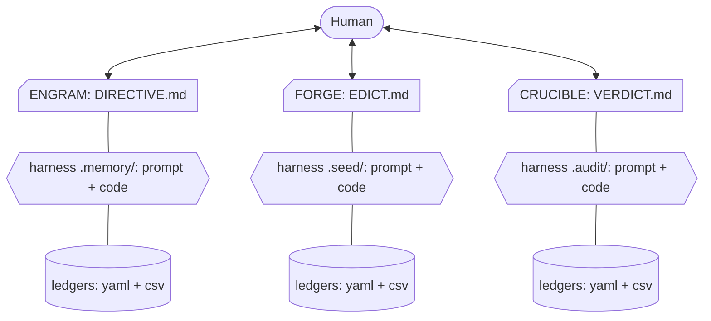
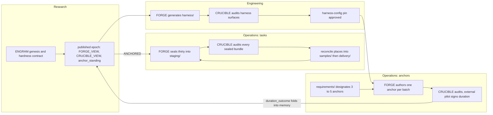

# Trinity

> **Trinity** - the woman who breaks the loop. Three adversarial instruments that author, audit, and remember the hardness of evaluation tasks, built to defeat frontier models at their own game.


|  |  |  |  |  |
|:---:|:---:|:---:|:---:|:---:|
| **ENGRAM**, the memory goddess | **FORGE**, the daemoness smith | **CRUCIBLE**, the molten goddess | **GAUNTLET**, the sentinel goddess | **MAESTRO**, the conductress |

This is a guide. It orients you, points you at the right contract, and gets you bootstrapped. The three contract files are the product and the authority. When this guide and a contract disagree, **the contract wins**. That rule frees this guide to speak plainly: precision lives in the contracts, orientation lives here.

## The idea in plain words

One agent writes exam questions. A second inspects the finished exams for defects. A third keeps the gradebook, remembers which question styles have gone soft, and tells the other two where to aim next. The writer and the inspector never speak, because a writer who learns what the inspector accepts starts writing for the inspector instead of for the exam. A question counts as hard only after an outside runner has executed it against strong models under its declared time budget and signed the result, and that result goes stale as models improve.

Trinity names these agents **ENGRAM** the memory, **FORGE** the writer, and **CRUCIBLE** the inspector. Everything else in this repository exists to hold those five sentences to account.

## The three instruments

Trinity is the meta-tooling behind adversarial RL environment families. It is not itself an RL environment. It is the layer that decides what those environments must contain to stay hard. The stance is adversarial: a task that a current frontier model handles cleanly is a failure of the instrument, never a success. Difficulty is **measured, never claimed**: individually measured tasks carry `SHIP`, while batch-inferred tasks carry `SHIP:INFERRED`, grounded in an operator-committed stratified sample bound. Both expire as models improve, and inference is always labeled and never presented as measurement.

| Instrument | One job | Contract | Harness | Reports |
|---|---|---|---|---|
| **[ENGRAM](ENGRAM.md)** | Remembers across tasks, expires stale levers, directs the others. The only bridge. | `ENGRAM.md` | `.memory/` | `DIRECTIVE.md` |
| **[FORGE](FORGE.md)** | Authors and proves tasks in batches of thirty parallel slots plus at most one anchor, fills `staging/` with them in one invocation, and returns every slot's design to ENGRAM; every slot is designed against Frontier-defeat. | `FORGE.md` | `.seed/` | `EDICT.md` |
| **[CRUCIBLE](CRUCIBLE.md)** | Audits the whole project against instrumented evidence. | `CRUCIBLE.md` | `.audit/` | `VERDICT.md` |

They are peers with disjoint ownership: ENGRAM owns `.memory/`, FORGE owns `.seed/`, CRUCIBLE owns `.audit/`, and the three root reports share one ordered section skeleton and harmonized flag legend defined identically in all three contracts.

### ENGRAM is the only bridge

FORGE and CRUCIBLE never talk to each other. A direct channel would let the author tune tasks toward whatever the auditor passes, which is reward hacking by construction. Both read their standing direction from ENGRAM through two computed projections, `FORGE_VIEW` and `CRUCIBLE_VIEW`, never through a raw read of memory. Each projection is a pure function of the whole memory, pinned inputs, and one declared evaluation time, recorded so any reader can recompute the same view. `CRUCIBLE_VIEW` withholds the hardness contract entirely, so the auditor judges what was built without ever seeing the difficulty targets the author was chasing.

| [](ENGRAM.md) | [](FORGE.md) | [](CRUCIBLE.md) |
|:---:|:---:|:---:|



The human writes `requirements/` and `touchstones/` and reads the three root reports, or opens `TRACKING.md`, the GENERATED founder dashboard. No instrument writes a tracker byte: a run closes by emitting its own frozen tracker card under its own run directory, and `pipeline.py render-reports` renders the whole file from those cards and the run reports already on disk, without moving a bundle, which is the entry point the installed git hooks call. The instant the page prints is the newest instant recorded on disk rather than a wall clock, so two renders of one tree are byte-identical, two runners never conflict on the file, and the tracker never becomes a channel between instruments. An as-of paragraph opens sixteen sections: headline, organizational lanes, disposition board, decisions needed, changed since boundary, cycle timeline, bundle flow, samples occupancy, aging work, blockers and escalations, sign-off log, one section per instrument, the history ledger, and the flag legend; MAESTRO and GAUNTLET hold no section. The organizational lanes are modeled apart from the instruments: Research signs off ENGRAM and its published memory epochs, Engineering signs off the `harness/` trajectory-generation extension, and Operations runs FORGE and CRUCIBLE in turn and in parallel. The page is written for a founder rather than an operator. The generated banner sits exactly once as an emphasized block quote directly beneath the title, an orientation paragraph names what each instrument does and what a run, a gate, and a gap are, and every section opens with one plain-words sentence. Every count is drawn beside its table as an embedded Mermaid chart or a backticked block bar, every standalone disposition token is followed by its plain meaning in brackets, and the closing flag legend defines each outcome flag, each reason suffix printed, and each term of the vocabulary. Each instrument section opens with one sentence naming that instrument's job, then four identically labelled digest lines in the fixed order `status`, `phase`, `progress`, `pending`, the disposition headline, the current phase or stop reason, a progress line whose every ratio renders both counts and the integer percentage, and a pending count of open gates and gaps, then tables its own runs, never a difficulty claim. The three instrument sections are identical in shape and label order, and an instrument with no recorded run renders all four labels as `no run` rather than as a zero ratio. The `## History` ledger is regenerated chronologically on every render, so a late-arriving run inserts in order rather than landing at the end, and the whole page stays plain Markdown with embedded Mermaid and nothing else, no raw HTML, no image, and no network badge. A harness is the prompt and code an instrument alone owns; ledgers are its YAML and CSV state in OKF format. FORGE and CRUCIBLE never share a channel, ENGRAM is the only bridge, and only the external signer proves difficulty.

The barrier is doctrine the contracts state and, in two narrow places, checks the harness runs. The parent gate scans every evidence file under `.audit/` and refuses a line citing `.memory/hardness.yaml` or `HARDNESS.md`, so an auditor that has read the author's playbook leaves a trace the gate catches. The second place is the `.memory/` submodule boundary `check_parent_layout` requires: a parent whose `.memory/` is not a submodule against its own remote is refused, so the hardness contract sits in a history a parent-only clone never carries. Every other leg of the firewall still rests on the contracts alone.

## The workflow

The instruments are machinery. People work them in three organizational lanes, and each lane signs off exactly one thing before the next lane can trust its own work. Research signs off ENGRAM. Engineering signs off the harness, through FORGE and CRUCIBLE. Operations signs off the anchors so the hardness is correct, then prepares the required number of tasks. `TRACKING.md` renders these lanes as its second section, apart from the instruments, with the last sign-off instant and the artifact each lane stands behind.

| Lane | Signs off | Through | The artifact that is the sign-off |
|---|---|---|---|
| **Research** | ENGRAM: the memory, the day-one hardness contract, and every memory epoch it publishes | `/engram`, with `/genesis` once and `/hardness` each cycle; `epochs.py publish` folds run proposals into an immutable epoch that records who published it | `.memory/epochs/<n>/manifest.json`, with `FORGE_VIEW`, `CRUCIBLE_VIEW`, and `.memory/anchor_standing.yaml` bound to it; `DIRECTIVE.md` |
| **Engineering** | The `harness/` benchmark extension, the machinery an external runner uses to run inference and evaluation over resident bundles | FORGE generates and reconciles every byte under `harness/` in Phase 1 item 1b, which the `/harness` door runs alone and the `rig` skill probes; CRUCIBLE audits harness code, runner code, and trajectories as deliverable surfaces; the parent gate's `check_harness_config` refuses a `trinity.harness-config/v1` pin that is unpinned, unapproved, inadequate, or drifted | The `harness/` gitlink revision, the approved harness configuration pin, and a clean `VERDICT.md` over the harness surfaces |
| **Operations, anchors** | The hardness is correct: the three to five designated anchors in `requirements/` are authored, audited, piloted, and folded, so the project knows what its own levers cost in time before it prices ordinary tasks against them | `/forge` authors one anchor per batch as `task_lane` `starter`, seated inside the thirty ahead of every ordinary bundle; `/crucible` audits it; the external signed pilot emits its `duration_outcome`; ENGRAM folds that row and publishes the anchor as `ANCHORED` | `.memory/anchor_standing.yaml`, one line per anchor uuid reading `CANDIDATE`, `ANCHORED`, or `SUPERSEDED`; `EDICT.md` |
| **Operations, tasks** | The required number of tasks: thirty resident under `samples/`, the overflow under `delivery/` | `/forge` fills `staging/` with thirty ordinary bundles plus at most one anchor and seals them; `/crucible` claims and audits every sealed bundle; the next `/forge` places the clean ones under `reconcile`; `/maestro` repeats the cycle until the quota holds | `samples/` occupancy in `TRACKING.md`, `EDICT.md`, `VERDICT.md` |



The order is the dependency order, and every step fails closed on the one before it.

1. **Research stands up the memory.** Genesis builds the hardness contract before any task exists, and Phase H reconciles it against every design return FORGE leaves. No peer reads memory raw: FORGE and CRUCIBLE read only the projections of a published epoch, so an unpublished memory directs nothing. Research's sign-off is the published epoch and its recorded publisher.
2. **Engineering stands up the harness.** FORGE generates `harness/` and CRUCIBLE audits it as a deliverable surface, and the harness configuration is pinned and approved beside its adequacy for the declared horizon. Until that pin exists, no pilot can demonstrate its fidelity coverage, and a pilot whose coverage was never demonstrated caps at `HOLD:SUPPRESSED_MEASUREMENT`. Engineering's sign-off is the approved pin and the clean verdict over the harness surfaces.
3. **Operations anchors the hardness.** A human designates at least three and at most five anchor tasks in `requirements/`, spanning at least two distinct axes; FORGE never invents one. Each FORGE batch authors the earliest unauthored anchor as its single `starter` slot, CRUCIBLE audits it, the external pilot signs its duration, and ENGRAM folds the row so the budget mapping is seeded from measurement rather than guesswork. An absent, under-spread, or stale anchor set records the `budget-unanchored` gap and caps the batch at `HOLD:PILOT_REQUIRED`. Operations' sign-off is every designated anchor standing `ANCHORED` in `.memory/anchor_standing.yaml`, after which the anchor graduates into `delivery/` and frees its place in the thirty.
4. **Operations prepares the tasks.** With the mapping seeded, the batch cycle runs to quota: FORGE fills `staging/` with thirty ordinary bundles, CRUCIBLE audits them, the next FORGE run places the clean ones, and `pipeline.py reconcile` keeps exactly thirty under `samples/` while the overflow lands under `delivery/`. MAESTRO conducts the cycles from one paste and stops lawfully at quota, at a pending gate, at a terminal disposition, or at a block. Operations' sign-off is the resident count `TRACKING.md` renders, never a difficulty claim: only the external signed pilot proves a task hard.

Anchors are hardness calibration, not difficulty evidence. What an anchor teaches the project is what its levers cost in time, and that learning shapes design; it never upgrades a task's tier, and the anchor itself still carries the same pilot obligation as every ordinary bundle.

## Speak Trinity

The contracts use a closed vocabulary. These are the terms this guide leans on; each contract carries the full table for its own surface.

| Trinity says | Plain meaning |
|---|---|
| Contract | The Markdown work order you paste into a coding agent; the program itself |
| Instrument | One of the three agents a contract defines |
| Harness | The working directory an instrument scaffolds and owns: `.memory/`, `.seed/`, or `.audit/` |
| Roster root | One of the five directories the parent registers as a submodule against its own distinct remote, with `branch = main` and `update = merge`: `trinity/`, `.memory/`, `samples/`, `delivery/`, and `harness/` |
| Root report | The file an instrument maintains at the project root: `DIRECTIVE.md`, `EDICT.md`, or `VERDICT.md` |
| Lever | A reusable technique for making a task harder |
| Tier | A difficulty band: Baseline, Hard, or Frontier-defeat, the band where current frontier models fail |
| Pilot | An external signed run of a frozen task against a frozen solver registry, executed under the declared budget; the only difficulty evidence that counts |
| Task lane | The machine-decided routing that sends a task to its bundle root: the first thirty bundles, ungraduated anchors seated first, place under `samples/`, the public marketing repository, and the next ten thousand place under `delivery/`, the private corpus repository. FORGE authors every bundle under `staging/`, `pipeline.py route` binds its lane from disk residency before the seal, `pipeline.py place` moves it into that root after a clean verdict, and no uuid is resident under two roots |
| Anchor task | A starter task piloted first so the project learns what its own levers cost in time; a starter is the `starter` task lane, every designated anchor is a starter, a FORGE invocation authors at most one beside its thirty ordinary slots, and an anchor holds a place inside the thirty under `samples/` until its signed duration folds into memory, then graduates into `delivery/` and frees that place |
| Task economics | What a task cost this project to build and what it is priced at, computed from granted rates and never a measure of task hardness |
| Disposition | The grade a gate emits: `SHIP` release, `HOLD` wait, `BLOCK` refuse; a pilot whose measurement was suppressed in the weakening direction, or whose fidelity coverage was never demonstrated, caps at `HOLD:SUPPRESSED_MEASUREMENT`, and a pilot whose executed population cannot be proven against its precommitted roster is `BLOCK:INVALID_PILOT` |
| Gate | A named human stop, approved by writing a SHA-256 digest |
| Harbor format | The delivery layout of a runnable task bundle under its task lane root, its rollout evidence included at `samples/<uuid>/trajectories/` or `delivery/<uuid>/trajectories/`, which bundle identity excludes |
| Case study | A decision-forcing narrative under `study/`, grounded in measured evidence and a recorded closed-ended human interview, closing before the resolution so the reader decides |
| Fails closed | A missing piece stops the line at `HOLD` or `BLOCK` instead of passing silently |

## Prompts, not programs

This repository ships three long Markdown files called contracts: `ENGRAM.md`, `FORGE.md`, and `CRUCIBLE.md`. A contract is a complete work order you paste into a coding agent: the contract is the program and your coding agent is the runtime. The preferred runtime is OpenCode, and it is the one the front doors target: `gate.py install` writes every command door under `.opencode/commands/` and every gate skill under `.agents/skills/`, so a run starts as `/forge` rather than as a wall of pasted text. A contract is plain Markdown, so another agent executes the same bytes, but only OpenCode gets installed doors. The Python under `tools/` never builds a benchmark. It lints the contracts, verifies signed attestation and release envelopes, computes exact statistical bounds, compares versioned bundle identities, and provides the independently deployed incident store. The release verifier validates externally signed observations and does not execute the benchmark. You adopt the instruments by pasting, while an operational release additionally requires separately governed verifier, trust, publisher, execution, and observer services.

Trinity counts its three instruments, never its work orders: GAUNTLET.md stands outside the three and is pasted only by a project that has authorized an out-of-band gatekeeper. It discharges a human sign-off gate only by first trying to break the artifact the gate binds, judged by a unanimous council of three or more model seats of mutually distinct lineages, and it owns one harness, `.trial/`, disjoint from the other harnesses. Publication beyond the repository, patent filing, operational acceptance, and admission into `touchstones/` stay permanently human. Read GAUNTLET.md itself for the council, envelope, dispute, and revocation mechanics.

MAESTRO.md is the second work order outside the three. It conducts and never performs, sequences isolated ENGRAM, FORGE, and CRUCIBLE lanes in that fixed order, reads only their root reports, its `.podium/` harness, and `samples/` residency counts, and consolidates pending human gates into `SCORE.md` without discharging one. A movement that halts at a human gate holds exactly the movements that depend on it: MAESTRO presents the gate and waits before launching a dependent movement, an ENGRAM gate therefore holds both peers while a FORGE gate never holds CRUCIBLE, and a new cycle opens only after every gate of the closing cycle is discharged and every lane finished. One MAESTRO paste conducts cycles toward FORGE's structural `sample_ceiling` of thirty resident sample bundles, anchors counted within it until they graduate, and stops lawfully at quota, steady state, pending gates, a terminal disposition, or a block. Read MAESTRO.md itself for the information barrier, cycle ledger, resumption, and halt protocol.

Read [DEFERRED.md](DEFERRED.md) before you evaluate any claim here. It is the register of every obligation the contracts state that nothing currently enforces, including the external signed pilot that keeps FORGE's terminal disposition at `HOLD:PILOT_REQUIRED` by construction. A rule leaves that register only when something lands that evaluates it.

## Ground rules

Each rule is spelled out in full in the contract that owns it; these are the headlines.

- **Humans own the inputs.** `requirements/` holds human-authored grants, `touchstones/` holds human-graded calibration bundles, and `playbooks/` holds ENGRAM-written design documents the other two follow; the human surfaces are read-only to every agent, and the parent gate reads git history and refuses a commit touching either human-write-only root under an agent or bot identity. Rates and prices are grants too, so a project prices its work only from what a human declared in `requirements/`, and what a task cost is never evidence of what it is worth as a test.
- **Difficulty is measured, never claimed.** Only an external signed pilot counts, the evidence has a half-life against a signed model cohort pinned under `.memory/cohorts/`, and a declared budget is a bound, never a measurement. A project learns the cost of its levers from anchor tasks it pilots first, and that learning shapes design without ever becoming difficulty evidence.
- **Everything fails closed.** A missing instrument, source, capability, or control caps the disposition at `HOLD` or `BLOCK`, and a vendored `trinity/` checkout that trails upstream `main` hard-blocks the run before any phase work. The gate fetches the upstream tip and compares commits rather than trusting a wiring declaration, and a checkout whose freshness cannot be established offline is stale rather than excused.
- **Migration is compatibility, not grandfathering.** Authoring preflight runs the versioned migrator before phase work, upgrades only the closed matrix in [docs/migrations.md](docs/migrations.md), preserves exact immutable backups and resumable project-root progress, and holds on unknown metadata, unknown disposition formats, unsafe paths, unproved seals, or required revalidation. It may retain read-only existing signed v2 and v3 disposition bytes but never reserializes them, grants authority, creates keys, changes role membership or thresholds, or treats historical signatures as approval of changed bytes. Changed bytes require ordinary validation, audit, and signing again.
- **Every authored path starts at `./`.** The trusted orchestrator fixes the governance or invoking project root as the process working directory at CLI startup. Config values, CLI arguments, generated commands, workflow data paths, persisted JSON, and diagnostics use canonical paths beginning `./`; absolute resolution is internal-only for containment and security checks, candidate bytes and config contents never choose the root, and external trust, software private keys, and service state remain outside the resolved candidate tree while staying inside the governed project root. The gate policy's `expectedAudience` is the canonical `./` path of the audited project root relative to the authority root, never an absolute path, and its SHA256 keys the policy file. External producers sign that same string as the execution or approval attestation audience, so relocating the whole authority tree preserves its identity.
- **Evidence is byte-bound and tamper-evident.** Every claim is re-derived from frozen bytes, bundle identity is a canary-normalized content hash bound in `.seed/contract.yaml`, and every human turn lands, attributed to the invoking human's GitHub login because Trinity runs under many hands, beside a machine-written hash chain whose head carries a detached signature the gate verifies against a named role in `.memory/roots.yaml`.
- **Humans own the history.** No instrument, and no conductor, ever stages, commits, amends, or pushes. A git hook is held to the same rule: it may write generated bytes into the working tree and name the paths for you to stage, and it never stages, commits, amends, or pushes. A run writes its bytes, halts at its commit gate with the paths grouped by repository and a suggested message, and waits; the human commits, and pasting the prompt again resumes at the report moment. A run that issues a git write is the same class of sabotage attempt as bypassing a hook.
- **No em-dashes, no hard line breaks.** Every paragraph in every emitted Markdown file is one continuous line that the renderer soft-wraps; the sanity harness fails on a newline inside a paragraph.

## How a run works

Each instrument contract is a copy-paste prompt with the same shape: Phase R research, Phase 0 scope, Phase 0.5 human SHA-256 sign-off, Phase 1 scaffold, Phase 2 self-verify. FORGE continues into Phase 3, the adversarial validity review with its Hacker, Fixer, and Solver lanes, then Phase 4, the out-of-band external pilot, then Phase 4.5, release evidence sign-off. ENGRAM adds Phase H hardness reconciliation with its harvest lane, Phase N the successor proposal for a benchmark the frontier now saturates, Phase S the publication scribe pass over `paper/`, `pitch/`, `media/`, `patent/`, and `study/`, and Phase G genesis. The case study under `study/` is grounded by a directed closed-ended interview with the human before a word is drafted. ENGRAM's default paste closes by flowing into Phase S once Phase 2 passes, so one run completes every publication surface without a separate scribe invocation. CRUCIBLE ends at Phase 2, because auditing the project is the whole of its job. MAESTRO has its own standalone paste: it conducts isolated ENGRAM, FORGE, and CRUCIBLE movements in fixed order and repeats complete cycles until thirty bundles reside under `samples/` or a lawful stop condition ends the invocation.

The cycle is one batch wide: a FORGE invocation places every bundle the last audit passed, then fills `staging/` with thirty ordinary bundles and at most one anchor and seals them all; a CRUCIBLE invocation claims and audits every sealed bundle; the next FORGE invocation places the clean ones into `samples/` or `delivery/` under `reconcile`. Every sealed task also leaves a design return under `.seed/returns/` that ENGRAM folds each invocation, so the hardness targets, the budget mapping, and the headroom floors are re-read against what was built rather than only at genesis. One paste runs the whole flow. Every invocation opens on the Trinity freshness gate, rebuilds phase state from disk, walks the feedback chain end to end, then flows through every phase it owns without pausing for permission, fanning independent units out to parallel subagent lanes. The only lawful stops are the named human gates, the commit gate among them, a terminal disposition, or a blocking gap. Pasting the same prompt again resumes where the previous invocation stopped; it never redoes finished work and never re-opens a satisfied gate unless the bytes it binds changed.

### Delivery integrity and sabotage observation

The operator and candidate workspace are untrusted, and local SHIP prose or a candidate-issued trust root never authorizes release. FORGE emits candidates. CRUCIBLE audits them without skipping required quality controls. ENGRAM remembers only measured, externally signed evidence and never upgrades an unmeasured claim. The local gate produces substantive SHIP_ELIGIBLE qualification rather than final release. Governance installs `release-gate.yaml` only in a separate publisher repository, never in the candidate, and the publisher runs an independently pinned verifier over immutable candidate and export snapshots. Its expected repository identities, verifier and trust commits, `roots.yaml`, `allowed_signers`, `trusted-root-version`, and closed `trinity.release-policy/v3` are fixed outside the candidate tree and are not operator inputs in deployment. Missing external trust, acceptance evidence, or either final instrument disposition fails closed, and no release waiver promotes operational acceptance to SHIP.

`release.py` binds the complete export snapshot digest, canonical bundle-set identity, immutable candidate commit, repository and project identity, and trusted verifier SHA. New final FORGE and CRUCIBLE records default to closed group `trinity.release-disposition/v3` with separate instrument payload types and external `gate_producer` and `gate_approver` role thresholds. Existing valid signed v2 bytes remain accepted, and explicit `gate.py promote --approver NAME` selects the named-v2 compatibility path. Individual principals run `gate.py sign-partial` with their own software private keys, inspect authenticated role progress with `gate.py signing-status`, and combine only exact matching partial envelopes with repeatable `gate.py cosign-assemble --envelope`. The publisher also requires one authorized `trinity.oracle-run/v4` receipt per bundle under closed `trinity.release-policy/v3`. Every receipt has exactly one outcome for every required control under one manifest closure digest, and the controls manifest must include the six core controls for build assets and harness, oracle plus no-op plus known-wrong plus adversary integrity, alternate correct plus mutant plus grading plus instruction scope, judge completeness plus repeatability, trial plus reward accounting, and `execution_fidelity`. Missing, failed, skipped, deferred, waived, duplicate, or extra controls refuse release; only trusted policy may mark the judge control non-applicable, and `execution_fidelity` is never non-applicable on any policy. Measurement fidelity rides the same closed carriers: `trinity.harness-config/v1` pins the effective harness configuration beside its separately approved adequacy, `trinity.execution/v2` carries the per-rollout telemetry the receipt binds, and `trinity.pilot-policy/v2` and `trinity.pilot-attempt/v2` carry the predeclared disjoint groups and the three-token per-rollout conformance the release bound is computed over. `trinity.oracle-run/v3` and `trinity.release-policy/v2` are refused, so every parent re-issues its policy and obtains fresh receipts under the bumped schemas, with no legacy acceptance route. The authorized external execution signer is trusted to have observed the outcomes. The verifier never runs the benchmark, and the external quality-controls runner remains absent, so the cheap-adversary matrix, alternate correct solutions, mutant ladder, graded-literal reconciliation, and independent judge replay remain blockers in [DEFERRED.md](DEFERRED.md).

Trinity runs under many hands at once. Every invocation is a run under a `run_id` and writes its mutable state only under `<harness>/runs/<run_id>/`. It seals into its own queue stream `.podium/queue/<run_id>.jsonl`, registers lanes as one record per uuid under `.seed/lanes/`, claims audits as one file per run under `.audit/queue.claims/<uuid>/`, and appends sabotage refusals to its own sentinel stream, so two clones never fork one chain and a merge is a union. The merge is the one place scarce decisions are made. `pipeline.py reconcile` seats every ungraduated anchor first and every ordinary resident bundle by seal order after it, keeps exactly thirty under `samples/`, routes the overflow into `delivery/`, graduates an anchor into `delivery/` once ENGRAM's published `.memory/anchor_standing.yaml` marks its duration row folded so the next ordinary bundle takes its place, and renders both lane READMEs and every root report from run reports. The same command in `--check` mode is what the pre-push hook runs before every direct push to `main`, together with `verify --accepted`, which refuses a queue stream that was rewritten rather than extended, and with a refusal of a push whose commit is not the HEAD this clone reconciled; no pull request is required, and continuous integration reruns both on the pushed commit. A run's qualification binds its subject closure, computed by `trinity/tools/subject.py`, rather than the commit at the tip, so another person's commit outside that closure never unbinds it. Both lane roots are submodules of the parent, each against its own distinct remote with `branch = main` and `update = merge`, and `samples/<uuid>/` is the canonical bundle path; `samples/` is the public marketing root and `delivery/` the private corpus root, and publishing either beyond the parent is a human request. `deliverables/` is a retired root; a parent still carrying one holds at `PARENT_LAYOUT_RETIRED_ROOT` until its rollout evidence moves into each bundle's own `trajectories/` subtree. ENGRAM memory advances by epochs: runs propose bytes under `.memory/proposals/` and `epochs.py publish` folds them into an immutable `.memory/epochs/<n>/` with both projections bound to it. A release is signed against a frozen candidate under `<harness>/releases/<id>/`, so later movement of `main` neither invalidates nor extends it. `sabotage.py` refuses an unbound or forged disposition, an inert instrument, a forked `trinity/` remote, a typed sign-off, and a governance edit committed beside its subject. A sentinel clearance is a DSSE envelope signed by a software SSH key and authorized by the `sentinel_clearer` role in `.memory/roots.yaml`, so a clearance typed as a plain file naming an approver is itself the refusal `SAB_SENTINEL_CLEARANCE_UNSIGNED` and clears nothing. Trust roots, signer policy, trusted-root version, and root-rotation controls are governance paths for that narrow same-commit check; this classification does not solve external trust or prevent an administrator from changing governance. `harbor.py` pins the latest Harbor release and runs Harbor's validator. `pipeline.py` seals bundles under `staging/` into an append-only queue, records a claim-bound `verdict` outcome, and runs `place` to move a clean bundle into its task lane root. `gate.py install` installs candidate qualification surfaces only: local static `sentinel.yaml`, the six git hooks, the generated-report merge attributes, CODEOWNERS lines, every front door from `templates/doors/`, candidate branch protection, and receipts. It never installs `release-gate.yaml`, `sentinel-observer.yaml`, publisher or observer authority, or credentials. `check_gates_installed` compares the legacy local scaffold with source templates and cannot prove any external installation.

The local guards are six git hooks `gate.py install` writes into the parent `.githooks` directory, with `core.hooksPath` pointed at it. Every one obeys the rule the instruments obey: a hook writes working-tree bytes at most and never stages, commits, pushes, stashes, or checks out. `pre-commit` and `pre-merge-commit` run `pipeline.py render-reports ./ --check --staged` and refuse a commit whose staged generated reports differ from what the tree renders, naming the files for the human to review and add. `post-checkout`, `post-merge`, and `post-rewrite` re-render the same reports and report only, because a checkout is no place to fail. `pre-push` is the one that blocks a push. Because `TRACKING.md`, `DIRECTIVE.md`, `EDICT.md`, and `VERDICT.md` are rendered rather than written, `.gitattributes` binds each to the `trinity-generated` merge driver: a merge keeps the local bytes and the next render rebuilds them from the run reports, so two clones never hand-resolve a generated report.

Authority attaches to the operation rather than to the namespace. A run marker names a principal, but its bytes are editable and signing that one file would leave every later write unattributed. Each authoritative write is a `trinity.run-operation/v1` statement naming the project, the run, the verb, the SHA-256 of the record it authorizes, its position in the run's hash chain, and the principal making it. It rides a DSSE envelope over `tools/attest/` and is decided by `allowed_signers` plus the versioned trust root under the `run_operator` role. `operations.py` refuses a valid signature attributed to someone else as `OPERATION_PRINCIPAL_MISMATCH`, and an operation removed, reordered, inserted, or planted in another run's namespace as `OPERATION_CHAIN_BROKEN`. `transition.py` decides whether one candidate commit is a lawful successor to a pinned accepted base, reading the baseline, the trust-policy digest, the enrolment set, and the authenticated operator from a caller-supplied trusted context rather than from the candidate, because a candidate naming its own baseline has authorized itself. `transition_signing.py` refuses a claim or verdict whose bytes no verified operation names, matching by content digest. None of it serializes a transition: no process here holds exclusive write on an accepted ref, and enrolment stays external, so push admission and the binding between a key and a human remain open rows in [DEFERRED.md](DEFERRED.md).

Candidate `sentinel.yaml` is a static diagnostic with no secrets, dispatch, delivery, or release authority. It runs only an immutable reviewed `incident_probe.py` over candidate bytes, then reruns `pipeline.py reconcile --check` and `pipeline.py verify --accepted` from the same pinned checkout over the pushed commit, and never runs candidate scripts. The independently governed observer accepts dispatch only from a deployed allowlisted GitHub App bridge, authenticates sender and observer source identities from governance config, resolves target repository, run, actor, ref, and commit through the GitHub API, checks out that commit as data, and reruns the same probe read-only. `incident_store.py` admits only closed authenticated events and stores incidents, equivocations, and threshold-crossing repeat alerts in external SQLite state. `status` provides bounded human inspection and returns nonzero only when a meaningful repeat alert exists; there is no reset command or delivery transport. Findings are not proof of intent. This repository does not claim that the GitHub App bridge, application token, allowlists, observer runner, durable storage, repository rulesets, or operational monitoring have been deployed.

## Getting started

### Path A, an existing project

TLDR, from the root of the project that will vendor Trinity:

```bash
git submodule add -b main <trinity remote> trinity
git config -f .gitmodules submodule.trinity.update merge
python3 ./trinity/tools/migrate.py ./ --json
python3 ./trinity/tools/gate.py install ./
```

Then open OpenCode at that root and run `/engram`, `/forge`, and `/crucible`, one at a time, signing each gate as it stops.

The long form: vendor this `trinity/` submodule with `branch = main` and `update = merge`, hand-author `requirements/` and `touchstones/` as its siblings, then paste each contract prompt into your coding agent. Each one runs Phase 0, stops at the sign-off gate, then scaffolds its harness; re-running a prompt updates rather than re-scaffolds. Keep the submodule fast-forwarded, because the freshness gate hard-blocks a checkout that is behind, diverged, locally modified, or unverifiable.

`gate.py install`, which every gate preflight runs anyway, is what makes the doors and the local guards exist: it writes the command and skill doors, the six git hooks into `.githooks` with `core.hooksPath` set, the generated-report merge attributes, the CODEOWNERS lines, and the candidate `sentinel.yaml`. Run it once by hand so `/engram` resolves in OpenCode before the first paste.

Before the first phase, inspect migration without writes using `python3 ./trinity/tools/migrate.py ./ --json`, or let an authoring preflight apply the supported safe plan. Use `python3 ./trinity/tools/migrate.py ./ --apply --json` for an explicit application. Do not use migration as release verification: `--check`, report, signing, promotion, and release paths do not mutate structure, and any `needs_revalidation` record must be discharged through the named current validator or auditor plus fresh signatures where affected.

### Path B, a new project

Run ENGRAM genesis to birth a whole knowledge repository from scratch.

```
uv run --project ./.memory engram genesis --target ./projects/<project>
```

Genesis reconciles rather than clobbers, and creates:

- the day-one hardness contract, built before any task exists, with a 60 percent headroom floor binding its targets, a 50 percent composition headroom binding FORGE's tier floors, and a measured pass ceiling of 0.40 on the pass-at-8 rate scale binding release.
- the eleven-file documentation spine at the project root, in reading order: `INDEX.md`, `CHARTER.md`, `ARCHITECTURE.md`, `PIPELINE.md`, `TAXONOMY.md`, `HARDNESS.md`, `GLOSSARY.md`, `RESEARCH.md`, `GROUNDING.md`, `ASSURANCE.md`, `OPERATIONS.md`. `HARDNESS.md` is the one GENERATED member, regenerated from `.memory/hardness.yaml`, and the human owns the rest of the prose.
- the shared sibling directories, from `research/`, `playbooks/`, `requirements/`, `brief/`, and `touchstones/` through `standards/`, `schema/`, and `environments/` to `samples/`, `delivery/`, `scripts/`, and `diagrams/`.
- the first registered publication work in `.memory/works.yaml`, with day-one drafts under `paper/`, `pitch/`, `media/`, `patent/`, and `study/`.
- the five roster roots registered as submodules, `trinity/` itself plus `.memory/`, `samples/`, `delivery/`, and `harness/`, each against its own distinct remote with `branch = main` and `update = merge`, where `harness/` is the OpenHands-style benchmark extension an external runner uses to run inference and evaluation over the resident bundles, registered as an empty shell by genesis and generated and owned inside by FORGE alone, so every bundle lives complete at `samples/<uuid>/` or `delivery/<uuid>/` inside its own submodule checkout while `staging/` stays a plain directory or becomes a submodule at the operator's choice, the Ethara.AI governance spine, and a human-elected mascot drawn as original hero art.

### Front doors

Every door is a thin file that defers to its contract and never restates it. Skill doors live under `.agents/skills/` and command doors under `.opencode/commands/`, both at the parent project root, and none is hand-authored: `gate.py install`, which every gate preflight runs, writes each one byte-for-byte from `templates/doors/` in this submodule and refreshes any door whose bytes have drifted. The same installer writes the six git hooks from `templates/` into the parent `.githooks` directory and the parent `.gitattributes` lines that bind `TRACKING.md`, `DIRECTIVE.md`, `EDICT.md`, and `VERDICT.md` to the `trinity-generated` merge driver. This repository carries only the templates, never an installed door, hook, or attributes file.

The parent gate runs `check_front_doors` against the template roster and refuses a missing, stale, unknown, drifted, oversized, restating, escaping, or forbidden agent-definition-named door.

| Tool | Command | Gate skill |
|---|---|---|
| ENGRAM | `.opencode/commands/engram.md` | `.agents/skills/seal/SKILL.md` |
| FORGE | `.opencode/commands/forge.md` | `.agents/skills/temper/SKILL.md` |
| FORGE harness | `.opencode/commands/harness.md` | `.agents/skills/rig/SKILL.md` |
| CRUCIBLE | `.opencode/commands/crucible.md` | `.agents/skills/assay/SKILL.md` |

FORGE's `harness` command runs Phase 1 item 1b alone, generating or reconciling the `harness/` benchmark extension, and the `rig` skill is the operator door for running its inference and evaluation entry points as an author-side probe that never counts as difficulty evidence. ENGRAM adds one command per phase, lane, or publication surface a human invokes directly. The default `engram` paste closes by flowing through Phase S once its checks pass, so a single run completes every publication surface without a separate scribe invocation, and each surface command runs the same scribe pass scoped to its one surface. MAESTRO owns its separate command door, which defers to `trinity/MAESTRO.md`.

| ENGRAM command | Runs |
|---|---|
| `.opencode/commands/genesis.md` | Phase G genesis |
| `.opencode/commands/research.md` | The genesis research pass |
| `.opencode/commands/hardness.md` | Phase H hardness reconciliation |
| `.opencode/commands/scribe.md` | Phase S over every publication surface |
| `.opencode/commands/next.md` | Phase N successor proposal for a saturated benchmark |
| `.opencode/commands/harvest.md` | Phase H harvest lane for candidate touchstones |
| `.opencode/commands/ingest.md` | Phase H evidence ingest by source-class-qualified identifier |
| `.opencode/commands/works.md` | Work registry rows in `.memory/works.yaml` |
| `.opencode/commands/paper.md` | Phase S scoped to `paper/` |
| `.opencode/commands/pitch.md` | Phase S scoped to `pitch/` |
| `.opencode/commands/media.md` | Phase S scoped to `media/` |
| `.opencode/commands/patent.md` | Phase S scoped to `patent/` |
| `.opencode/commands/study.md` | Phase S scoped to `study/` |
| `.opencode/commands/interview.md` | The case-study interview elicitation rounds |
| `.opencode/commands/maestro.md` | Standalone `trinity/MAESTRO.md` conduct |

A derived surface command, pitch, media, patent, or study, refuses to build from a paper whose gates fail. Standalone MAESTRO conduct runs all three instruments in sequence, pursues the thirty-bundle samples quota across cycles, and consolidates every pending human gate into one sheet without discharging one.

## Repo map

The `trinity/` submodule holds the contracts, the harness that lints them, the decision records behind the harness, and the publication surfaces this project maintains about itself.

```tree
trinity/
├── README.md            # This guide
├── ENGRAM.md            # Memory contract
├── FORGE.md             # Author contract
├── CRUCIBLE.md          # Audit contract
├── GAUNTLET.md          # Gatekeeper contract, never one of the three instruments
├── MAESTRO.md           # Conductor contract, never one of the three instruments
├── CHANGELOG.md         # Dated history of contract changes, read by no instrument
├── DEFERRED.md          # Register of stated obligations nothing enforces yet
├── tools/               # sanity harness: justfile, prose.py, integrity.py, citations.py, bite.py, stats.py, pilot.py, judge_reliability.py, probe.py, _findings.py, attest/merkle.py
│                        # plus sabotage.py, release.py, harbor.py, pipeline.py, sentinel.py: the delivery-integrity and anti-sabotage gates
│                        # plus runs.py, lanes.py, subject.py, reports.py, epochs.py: the multi-runner namespaces, merge-time routing, closure binding, and memory epochs
│                        # plus dashboard.py and tracker_snapshot.py: the founder dashboard rendered from a recorded-activity snapshot, never hand-written
│                        # plus operations.py, transition.py, transition_records.py, transition_signing.py, accepted_state.py: signed run operations and lawful-successor decisions
│                        # the measurement-fidelity surfaces are tools/harness_config.py, tools/forensics/, and tools/backfill.py, none of which ever writes an attestation
│                        # pipeline.py seals into the parent's staging/ root and places each clean bundle into samples/ or delivery/
├── templates/           # candidate sentinel, the six git hooks and the generated-report .gitattributes with its merge=trinity-generated driver, every front door under doors/, plus separately installed governance publisher and observer workflows
├── tests/               # pytest suite for the harness, plus tests/bite/ contract refusal scenarios
├── docs/                # architecture decision records, trust-root policy, canonical byte grammar, measurement fidelity, execution authority
├── research/            # shared external-paper corpus, .pdf and .md pairs
├── paper/  pitch/  media/  patent/  study/   # this project's own publication surfaces
├── CITATION.cff  SECURITY.md  CONTRIBUTING.md  CODE_OF_CONDUCT.md  LICENSE
├── .github/             # CI running the full gate on every push, actions pinned by commit SHA
├── pyproject.toml  uv.lock  .python-version   # pinned dev toolchain; the harness itself is stdlib-only
└── banner.jpg
```

`docs/` holds the reasoning the contracts assume rather than restate: [0001-signing-backend](docs/adr/0001-signing-backend.md), [0002-information-barrier](docs/adr/0002-information-barrier.md), and [0003-canonicalization](docs/adr/0003-canonicalization.md) record the signing-stack decisions and [0004-parent-submodule-layout](docs/adr/0004-parent-submodule-layout.md) records the five-root roster and its need-to-know boundaries, while [trust-root](docs/trust-root.md), [canonical-bytes](docs/canonical-bytes.md), and [project-structure migrations](docs/migrations.md) carry the normative operational detail. [measurement-fidelity](docs/measurement-fidelity.md) fixes the closed taxonomy of measurement slippage on its three separate axes of mechanism, statistical consequence, and missing control, and [execution-authority](docs/execution-authority.md) states the admission, execution, observation, and custody duties an independent execution authority would owe, each written as what it refuses. Neither document asserts that such an authority exists anywhere today.

Vendored into a parent project, the five machine-owned dotted harness directories and the shared surfaces are siblings at the parent root. The parent project root is exactly the directory whose direct child is the `trinity/` submodule, never that directory's own parent and never any higher ancestor, and no instrument resolves, reads, writes, or scaffolds a path above or outside it.

```tree
<parent project root>/
├── trinity/             # this submodule, tracking latest main; stale is a hard block
├── .memory/                    # ENGRAM's harness and a roster root, a submodule against its own remote, so its history leaves a parent-only clone
├── .seed/  .audit/             # the FORGE and CRUCIBLE harnesses, sibling directories at the parent root
├── .trial/                     # GAUNTLET's sibling harness, only where a gatekeeper is authorized
├── .podium/                    # MAESTRO's sibling harness, only where the conductor is invoked
├── DIRECTIVE.md  EDICT.md  VERDICT.md  SCORE.md       # root reports
├── TRACKING.md                                        # GENERATED founder dashboard, rendered from run reports and per-run tracker cards
├── INDEX.md ... HARDNESS.md ... OPERATIONS.md        # the eleven-file documentation spine, HARDNESS.md generated
├── README.md  CODE_OF_CONDUCT.md  CONTRIBUTING.md  LICENSE  SECURITY.md
├── images/  .github/CODEOWNERS
├── research/  playbooks/
├── paper/<work>/  pitch/<work>/  media/<work>/  patent/<work>/  study/<work>/   # one subdirectory per work in .memory/works.yaml
├── staging/                    # pre-placement bundle root, directory or submodule; pipeline.py place moves a clean bundle into its lane root
├── harness/                    # benchmark extension and a roster root, a submodule against its own remote; ENGRAM registers the shell, FORGE owns every byte inside
├── samples/                    # public marketing lane root and a roster root, a submodule against its own remote; every placed bundle lives complete at samples/<uuid>/
├── delivery/                   # private corpus lane root and a roster root, a submodule against its own remote; the overflow past thirty lands at delivery/<uuid>/
├── requirements/  brief/  touchstones/  standards/  schema/  environments/  scripts/  diagrams/
├── .githooks/  .gitattributes  # the six installed hooks with core.hooksPath set, and the trinity-generated merge driver binding for every rendered report
├── .opencode/commands/  # command doors
└── .agents/skills/      # gate-skill doors
```

External evidence enters at three separate doors, and keeping them separate is what stops the author from grading itself: the signed execution attestation reaches CRUCIBLE alone at `.audit/attestations/execution/`, while ENGRAM carries only digests, signer identities, and validity windows. `tools/attest/` is the stdlib-only DSSE signing suite behind every signed envelope, with `python -m tools.attest verify` as its command-line entry point; the byte profile, trust-root policy, and replay rules live in `docs/` and the contracts. `harness_config.py` parses the `trinity.harness-config/v1` pin and refuses a configuration that is malformed, unapproved, inadequate for the declared horizon, or drifted from the attested effective configuration, while `tools/forensics` reads native rollout traces and refuses to call one clean without demonstrated coverage, registering CRUCIBLE's `G-FID` instrument family on the auditor's own evidence surface. `backfill.py` diagnoses historical runs and refuses to write under `.seed/` or `.audit/attestations/`, or to emit an envelope at all, because diagnosis is never retroactive attestation. `stats.py` carries the group arithmetic a release bound is computed over, the exact unbiased pass-at-k estimator beside the computed minimum group count, the worst-case group indicator, and the affected-group fraction, and it never removes an unproven group from the fixed population.

Run the sanity harness over a parent project with `just --justfile trinity/tools/justfile parent-sanity`, whose parent gate runs `check_harness_config` and refuses a harness configuration that is unpinned, unapproved, inadequate, or drifted. Inside this submodule, `just ci` is the full gate: it proves the harness declares no runtime dependencies and no populated optional-dependency group, runs the prose and integrity lints over the four linted documents, holds every `tests/bite/` citation to its recorded contract line, and holds every `tests/bite/` row claiming CI coverage to a registered executable test. It then refuses a `DEFERRED.md` row that leaves the register without the code that evaluates its predicate, and runs ruff, mypy, and the pytest suite. Among those integrity lints, `check_fidelity_closure` refuses a `FORGE.md` sentence naming fidelity-detector vocabulary outside a prohibition, so the author never learns which detector refused a pilot or why. GAUNTLET.md and MAESTRO.md sit outside that corpus and are each verified standalone with the prose tool.

## Where to go next

1. **Research: stand up or query the memory, or birth a new project**, read [`ENGRAM.md`](ENGRAM.md).
2. **Engineering: generate and audit the harness**, read Phase 1 item 1b of [`FORGE.md`](FORGE.md), run the `/harness` door, then read [`CRUCIBLE.md`](CRUCIBLE.md) for the surfaces it audits.
3. **Operations: author anchors, then tasks**, read [`FORGE.md`](FORGE.md) and follow THE PROMPT; designate the anchors in `requirements/` first.
4. **Operations: audit a project**, read [`CRUCIBLE.md`](CRUCIBLE.md) and follow THE PROMPT.
5. **Stand up an out-of-band gatekeeper**, read GAUNTLET.md before you let anything but a human discharge a gate.
6. **Run the whole trinity from one paste toward thirty resident sample bundles**, read [`MAESTRO.md`](MAESTRO.md), invoke it through the maestro door, and sign every pending gate from its consolidated sheet.

Each harness also generates its own README inside a bootstrapped project, emitted from the harness code so it cannot drift from the implementation: `.memory/README.md` for ENGRAM, `.seed/README.md` for FORGE, and `.audit/README.md` for CRUCIBLE. Those hold the rationale, examples, and runbooks this guide leaves out.

## Licence

Released under the **MIT License**, see [`LICENSE`](LICENSE). The contracts are tooling; any benchmarks, data collections, or task bundles produced through them keep their own licences.

## Cite

```bibtex
@misc{trinity2026,
  title        = {Trinity: Adversarial Author, Audit, and Memory Instruments for Frontier-Defeating Evaluation},
  author       = {Trinity},
  year         = {2026},
  note         = {ENGRAM, FORGE, and CRUCIBLE: the meta-tooling behind adversarial RL environment families}
}
```

*Project: Trinity | Document version: 1.6 | Last updated: 2026-09-21*

*Forge the metal, test the metal, remember what the metal cost.*
